# Holmes CTF 2025: *The Enduring Echo*

**Author:** Jonathan Lutabingwa ([@jtlutabingwa](https://github.com/jtlutabingwa)) 

**Team:** Sherlock's Homies
- [Jonathan Lutabingwa](https://www.linkedin.com/in/jonathan-lutabingwa/)  
- [Benjamin Taylor](https://www.linkedin.com/in/btayl106/)  
- [Greyson Brummer](https://www.linkedin.com/in/greyson-brummer-b82119301/)  
- [Lansina Diakite](https://www.linkedin.com/in/lansina-diakite-7a673b202/)  
- [Shaunak Peri](https://www.linkedin.com/in/shaunak-peri-315744245/)

---

**📋 Table of Contents**:
- 🟩 ["The Card"](./holmes_the_card.md)
- 🟨 ["The Watchman's Residue"](./holmes_watchmans_residue.md)
- 🟩 ["The Enduring Echo"](./holmes_enduring_echo.md)
- 🟥 ["The Tunnel Without Walls"](./holmes_tunnel_without_walls.md)
- 🟥 ["The Payload"](./holmes_the_payload.md)
  
---
**Prompt:** LeStrade passes a disk image artifacts to Watson. It's one of the identified breach points, now showing abnormal CPU activity and anomalies in process logs.

**Summary:** Actor “JM” breached Nicole Vale’s honeypot via web shell, stole credentials, set up persistence, and pivoted into the internal network. Evidence came from memory, bash history, configs, and process analysis.

**🟩 Challenge Difficulty:** *EASY*

---

## 📋 TL;DR (Answers)

- **First command (non-cd):** `systeminfo`
- **Parent process (full path):** `C:\Windows\system32\wbem\wmiprvse.exe`
- **Remote-exec tool:** `wmiexec.py`
- **Attacker IP:** `10.129.242.110`
- **First persistence element:** `SysHelper Update`
- **Script executed by persistence:** `C:\Users\Werni\AppData\Local\JM.ps1`
- **Local account created:** `svc_netupd`
- **Exfil domain:** `NapoleonsBlackPearl.htb`
- **Password generated:** `Watson_20250824160509`
- **Internal pivot IP:** `192.168.1.101`
- **Forwarded TCP port:** `9999`
- **Registry path for mappings:** `HKLM\SYSTEM\CurrentControlSet\Services\PortProxy\v4tov4\tcp`
- **MITRE ATT&CK ID for pivot technique:** `T1090.001`
- **Command to enable command-line logging (pre-attack):**  
  `reg add "HKLM\Software\Microsoft\Windows\CurrentVersion\Policies\System\Audit" /v ProcessCreationIncludeCmdLine_Enabled /t REG_DWORD /d 1 /f`

---
---

## 🚩 Flag 1: Initial Command

**Question:** What was the first (non-`cd`) command executed by the attacker?  

**Context:** Looking for the earliest command the attacker ran after gaining access to the host.

**Explanation:**  
I started by examining the Windows Event logs for process creation events because those tell us exactly which commands were spawned and when. Opening `Security.evtx` in Event Viewer, I filtered for **Event ID 4688** (Process Creation). Narrowing the results to the compromised host (`Heisen-9-WS-6`) allowed me to ignore unrelated noise. The earliest process creation that contained an actual command (not simple navigation) occurred at `2025-08-24 18:51:09` and the recorded command line was `systeminfo`. `systeminfo` is a reconnaissance command — attackers commonly run it immediately after access to enumerate OS version, patch level, and system configuration. That timeline and behavior make it the first meaningful command executed by the attacker.

**Pictures:**  
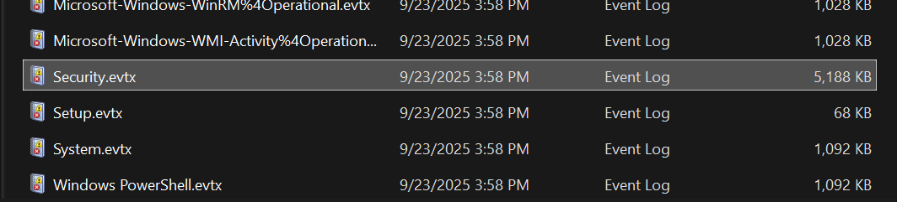  
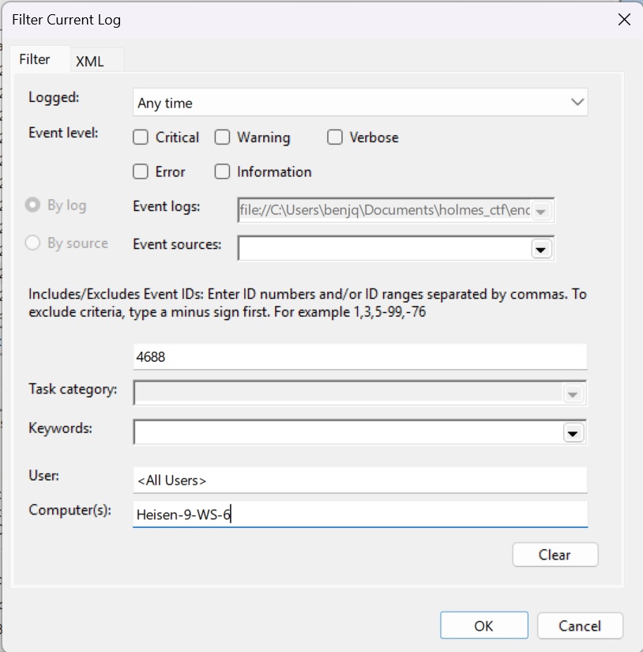  
  
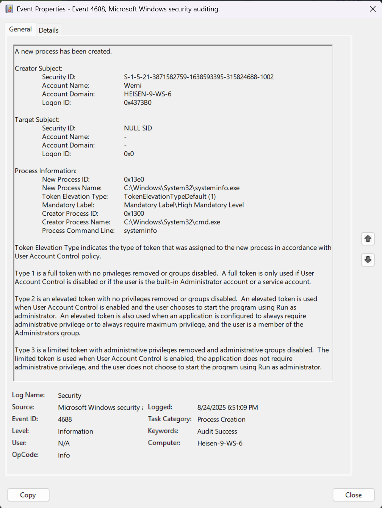

**Answer:** `systeminfo`

---

## 🚩 Flag 2: Parent Process

**Question:** Which parent process spawned the attacker’s commands? (full path)

**Context:** Determine which legitimate process the attacker abused to execute commands.

**Explanation:**  
To track how the commands were launched, I searched the same process creation events for clues about parent processes. Using keywords like `wmi` helped because WMI is a common remote-exec channel. The logs show the parent process as `wmiprvse.exe` located in `C:\Windows\system32\wbem\`. `WmiPrvSE.exe` (WMI Provider Host) runs as a service that executes WMI providers; it can be invoked remotely and used to run commands without leaving a heavy footprint on disk. Seeing attacker commands spawned under this parent indicates the adversary used WMI-based remote execution to run their payloads.

**Pictures:**  
  
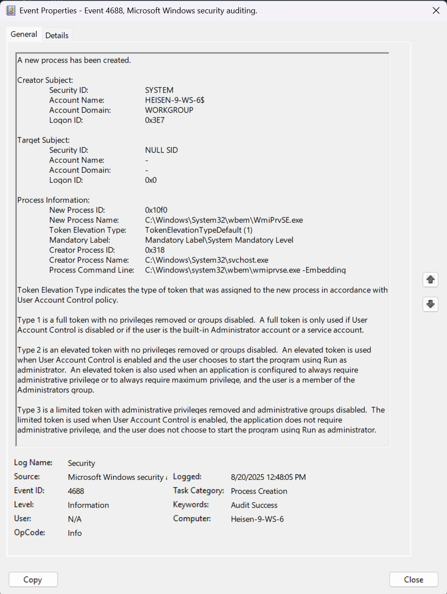

**Answer:** `C:\Windows\system32\wbem\wmiprvse.exe`

---

## 🚩 Flag 3: Remote Exec

**Question:** Which remote-execution tool was most likely used? (filename.ext)

**Context:** Infer the attacker toolchain from parent-process behavior and typical offensive frameworks.

**Explanation:**  
Given the evidence that `WmiPrvSE.exe` was launching commands, the pattern is consistent with tooling that leverages WMI for remote execution. A well-known offensive tool that does exactly that is **Impacket’s `wmiexec.py`**. `wmiexec.py` uses WMI to run commands on a remote Windows host under supplied credentials and commonly results in `wmiprvse.exe` appearing as the parent process for launched commands. No other remote-admin utility was present in the logs to indicate an alternative, so `wmiexec.py` is the most probable tool used.

**Pictures:**  
*(No additional screenshot for this flag.)*

**Answer:** `wmiexec.py`

---

## 🚩 Flag 4: Attacker IP

**Question:** What was the attacker’s IP address? (IPv4 address)

**Context:** Correlate successful logon events with source network addresses to find the attacker’s origin.

**Explanation:**  
I looked for **Event ID 4624** (successful logon) entries in `Security.evtx` around the timeframe when the first commands were executed. Successful remote logons often include a **Source Network Address** field. About 30 minutes after the initial `systeminfo` activity, a logon event captured the attacker’s source IP in that field. The source address recorded in the log matches the timeline of subsequent command execution, so it is the logical candidate for the remote attacker’s IP.

**Pictures:**  
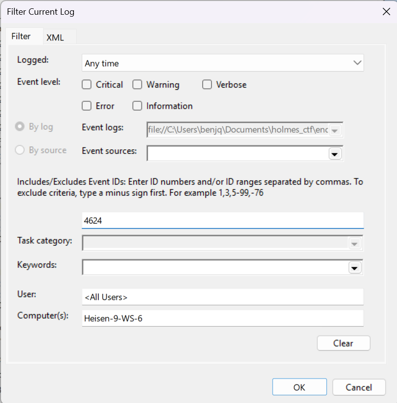  
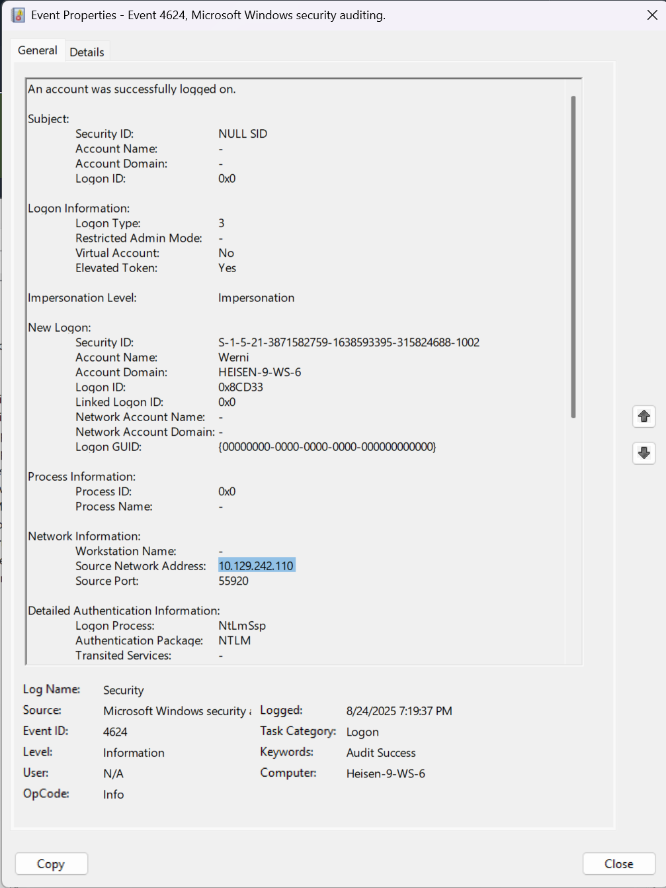

**Answer:** `10.129.242.110`

---

## 🚩 Flag 5: First Persistence

**Question:** What is the first element in the attacker’s sequence of persistence mechanisms? (string)

**Context:** Search the system for scheduling, services, or registry modifications made by the attacker.

**Explanation:**  
Persistence often appears as scheduled tasks, startup items, or registry autoruns. Inspecting the `C:\Windows\System32\Tasks` directory revealed a suspicious non-Microsoft task named **SysHelper Update**. Cross-checking process creation logs (Event ID 4688) showed the task was created and scheduled to run every 4 minutes with SYSTEM-level privileges — the attacker also redirected outputs to an admin share. The creation time aligns with the intrusion timeline and there were no earlier persistence artifacts, so `SysHelper Update` is the first persistence element the attacker deployed.

**Pictures:**  
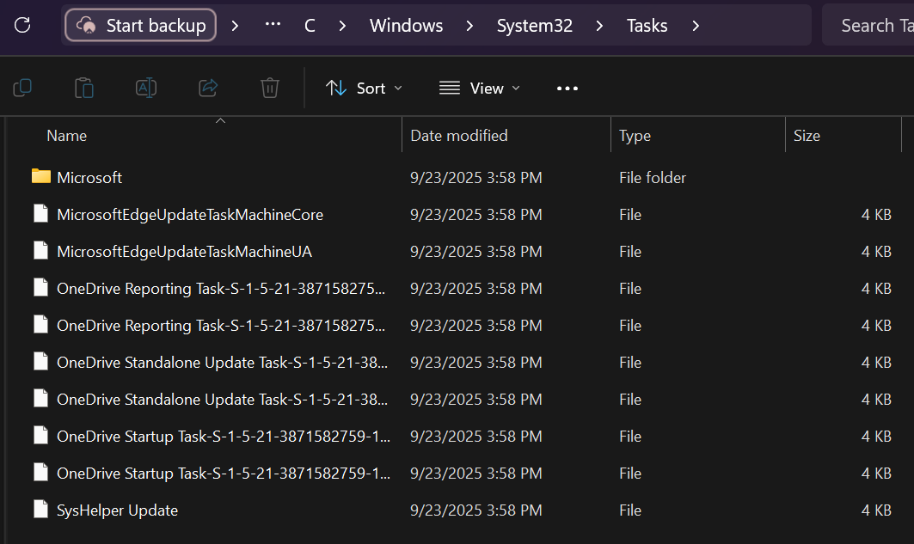  
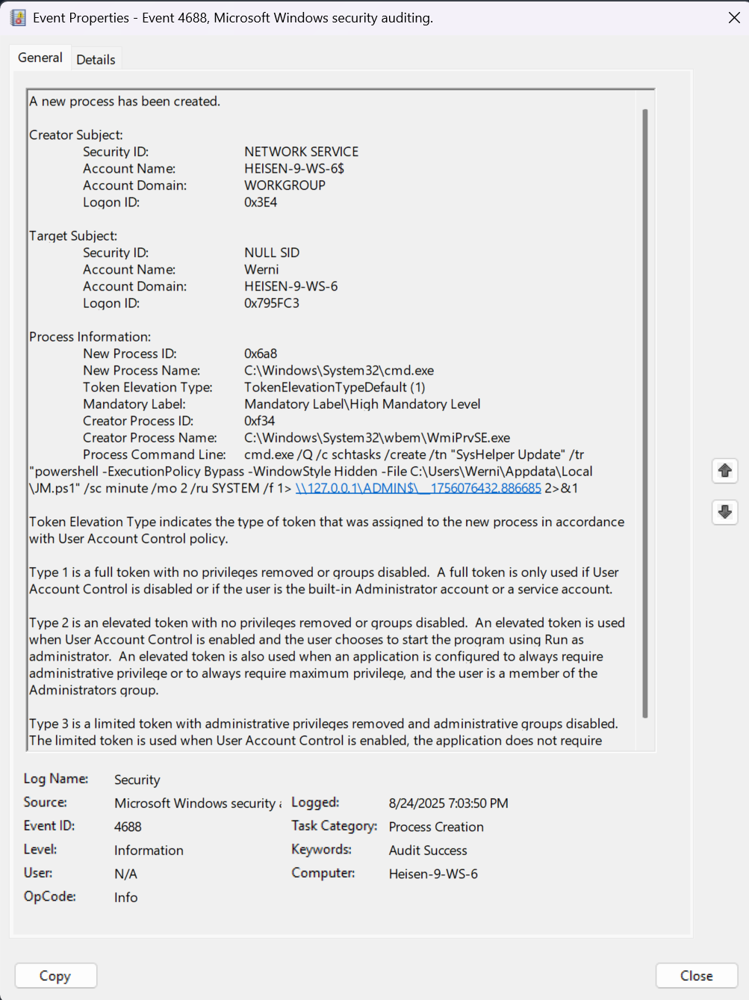

**Answer:** `SysHelper Update`

---

## 🚩 Flag 6: Persistence Script

**Question:** Identify the script executed by the persistence mechanism. (C:\FOLDER\PATH\FILE.ext)

**Context:** Scheduled tasks contain the path/command executed; extract that path.

**Explanation:**  
Opening the scheduled task definition (or examining the corresponding Event logs that record the task creation command) reveals the exact command executed by `SysHelper Update`. The task executed a PowerShell script located under the compromised user’s profile: `C:\Users\Werni\Appdata\Local\JM.ps1`. This script is the payload triggered by the scheduled task and contains the logic the attacker wanted to persist across reboots or scheduled runs.

**Pictures:**  
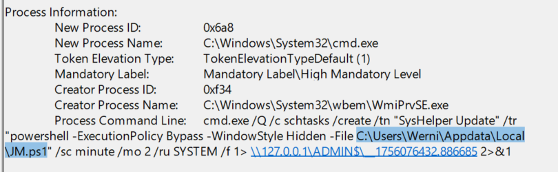

**Answer:** `C:\Users\Werni\Appdata\Local\JM.ps1`

---

## 🚩 Flag 7: Created Account

**Question:** What local account did the attacker create? (string)

**Context:** Check account-management events for user additions.

**Explanation:**  
Account creation is logged via **Event ID 4720**. Filtering the security logs for this event during the attack window returned a single user creation entry. Inspecting the event details shows the account added was named `svc_netupd`. Attackers commonly create service-like accounts with legitimate-sounding names to blend in; here the log shows it was created during the compromise and is therefore the account added by the attacker.

**Pictures:**  
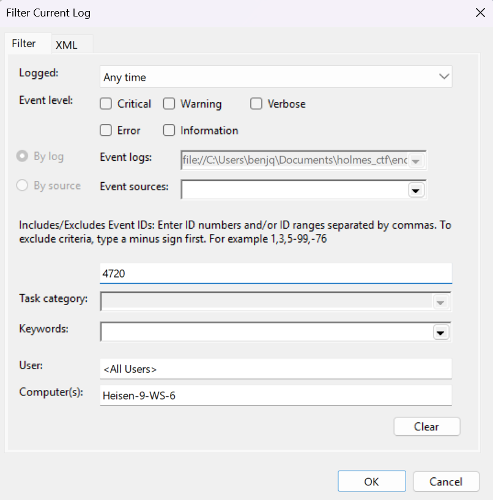  
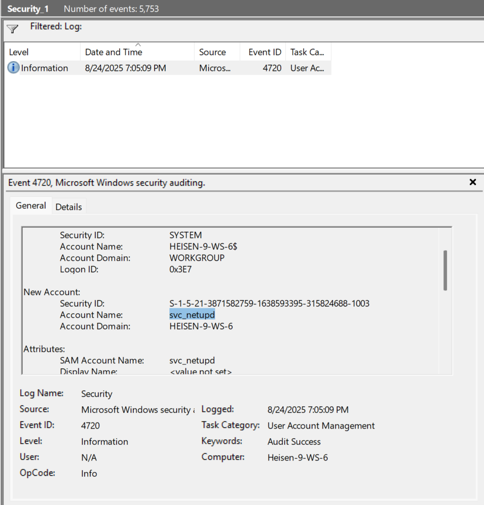

**Answer:** `svc_netupd`

---

## 🚩 Flag 8: Exfil Domain

**Question:** What domain name did the attacker use for credential exfiltration? (domain)

**Context:** Review scripts and network-sending logic for external endpoints.

**Explanation:**  
The previously identified persistence script `JM.ps1` contains outbound HTTP(S) calls. Inspecting the script reveals an `Invoke-WebRequest` (PowerShell) call targeting a domain used for exfiltration. The domain in the script parameters is `NapoleonsBlackPearl.htb`. This domain is the endpoint the attacker used to send collected credentials or exfiltrated artifacts.

**Pictures:**  
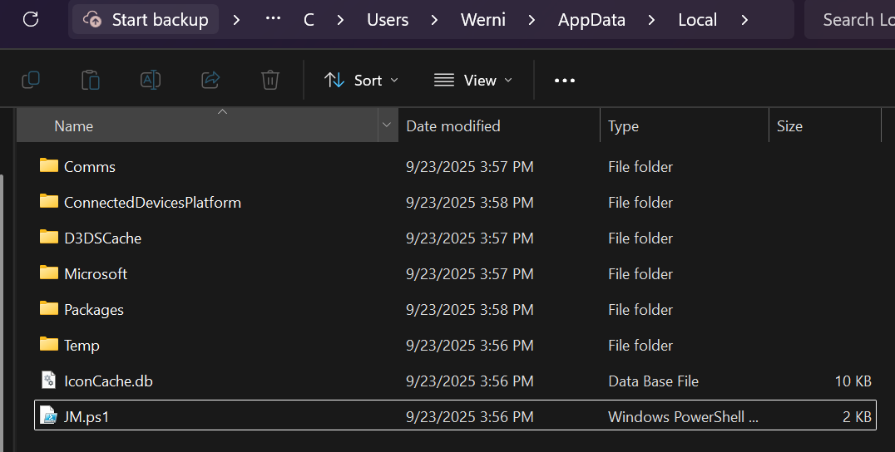  


**Answer:** `NapoleonsBlackPearl.htb`

---

## 🚩 Flag 9: Generated Password

**Question:** What password did the attacker’s script generate for the newly created user? (string)

**Context:** The script programmatically generates a password during the user creation routine.

**Explanation:**  
`JM.ps1` builds new account credentials by concatenating a static prefix (`Watson_`) with a timestamp in the format `yyyyMMddHHmmss`. To compute the exact generated password we need the precise time the user was created. Event ID 4720 shows the user `svc_netupd` was created at `8/24/2025 7:05:09 PM` in the system timezone. Using the system timezone (PST) the creation time is `2025-08-24 16:05:09` (24-hour). Formatting that timestamp as `yyyyMMddHHmmss` yields `20250824160509`. Prefixing with `Watson_` produces the password `Watson_20250824160509`. This approach ties the dynamically generated password to a logged event time, which is a common forensic technique for reconstructing scripted values.

**Pictures:**  
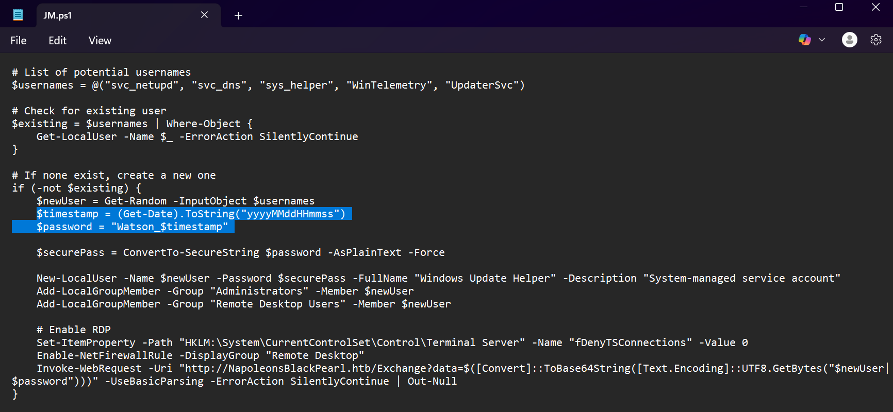  
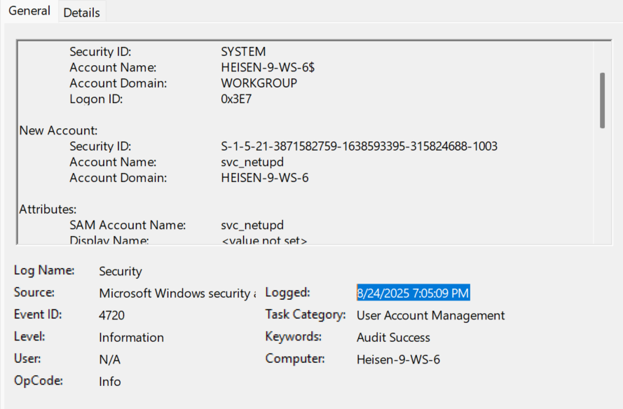  

**Answer:** `Watson_20250824160509`

---

## 🚩 Flag 10: Pivot Host

**Question:** What was the IP address of the internal system the attacker pivoted to? (IPv4 address)

**Context:** Check known SSH hosts and connection records to identify internal targets.

**Explanation:**  
The Administrator user's SSH configuration (`.ssh/known_hosts`) lists hosts the system has connected to previously. Inspecting that file revealed an entry that includes the address `192.168.1.101` (or hostname mapped to that address). Additionally, the attacker's port-forwarding and connection logs show connections forwarded to `192.168.1.101:22` during the pivot phase of the attack. Correlating these artifacts confirms that `192.168.1.101` is the internal system the attacker used as a pivot target.

**Pictures:**  
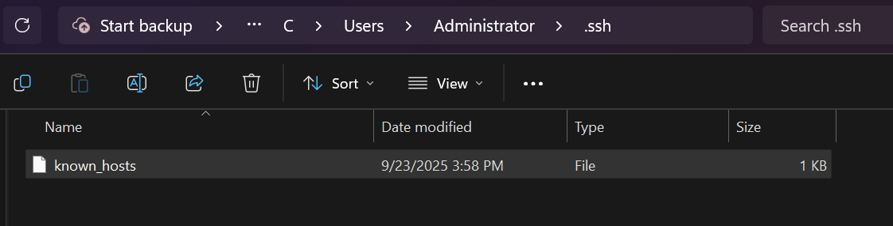  
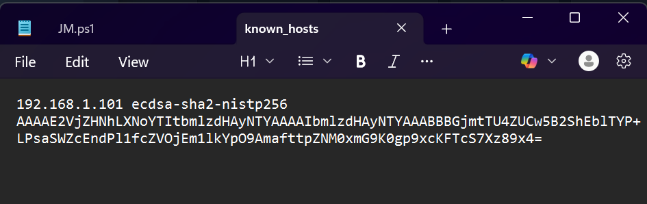  
  
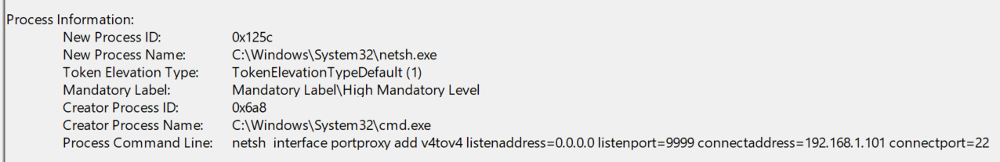

**Answer:** `192.168.1.101`

---

## 🚩 Flag 11: Forwarded Port

**Question:** Which TCP port on the victim was forwarded to enable the pivot? (port 0–65535)

**Context:** The pivot used a port-forwarding mechanism; locate the exact port used by the attacker.

**Explanation:**  
The attacker ran a `netsh interface portproxy` command to forward external connections to the internal SSH service. The full command logged in the event shows `listenport=9999` and `connectport=22` (the internal SSH port). This means the victim was listening on TCP port `9999` and forwarding incoming traffic to `192.168.1.101:22`. Using a high, non-standard listener port like 9999 is a typical tactic to bypass network filtering while still reaching the internal SSH host.

**Pictures:**  
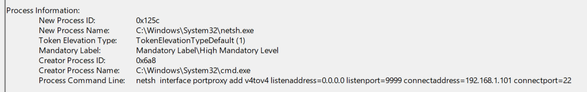

**Answer:** `9999`

---

## 🚩 Flag 12: PortProxy Key

**Question:** What is the full registry path that stores persistent IPv4→IPv4 TCP listener-to-target mappings? (HKLM\...\...)

**Context:** Persistent portproxy mappings are saved in the System registry; identify the live path.

**Explanation:**  
PortProxy mappings are stored under the System hive. While the hive contains multiple `ControlSet` snapshots, the live system uses `CurrentControlSet`. The registry path that holds persistent IPv4→IPv4 TCP mappings for PortProxy is:

`HKLM\SYSTEM\CurrentControlSet\Services\PortProxy\v4tov4\tcp`

This location enumerates each `listenaddress/listenport` mapping to `connectaddress/connectport` and persists across reboots. The evidence for this path is visible when inspecting the SYSTEM registry hive and the `Select` key that points to `CurrentControlSet`.

**Pictures:**  
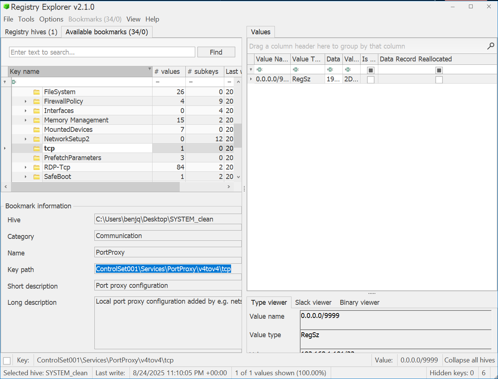  
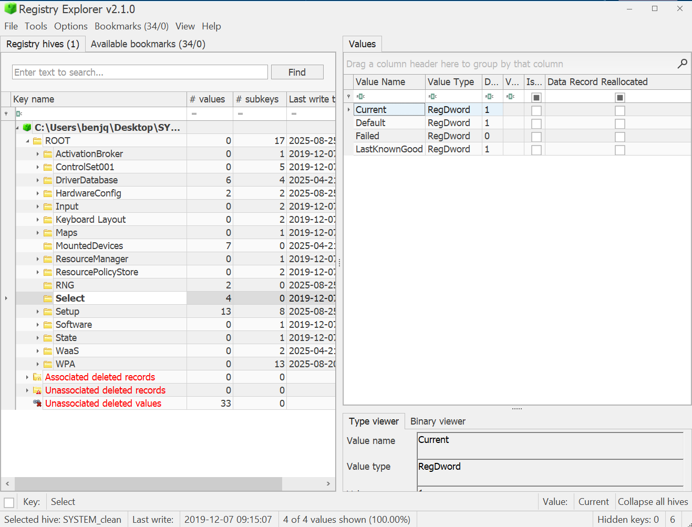

**Answer:** `HKLM\SYSTEM\CurrentControlSet\Services\PortProxy\v4tov4\tcp`

---

## 🚩 Flag 13: ATT&CK ID

**Question:** What is the MITRE ATT&CK ID associated with the previous technique used by the attacker to pivot to the internal system? (Txxxx.xxx)

**Context:** Map the observed technique (internal proxying / port forwarding) to the ATT&CK framework.

**Explanation:**  
MITRE ATT&CK documents techniques and sub-techniques. The use of `PortProxy` to forward connections and act as an internal proxy aligns with the **Internal Proxy** category under command-and-control / lateral movement techniques. Looking up the PortProxy / internal proxying technique on the MITRE ATT&CK site maps it to **T1090.001**. This provides a canonical identifier for reporting and defensive coverage mapping.

**Pictures:**  
  
  
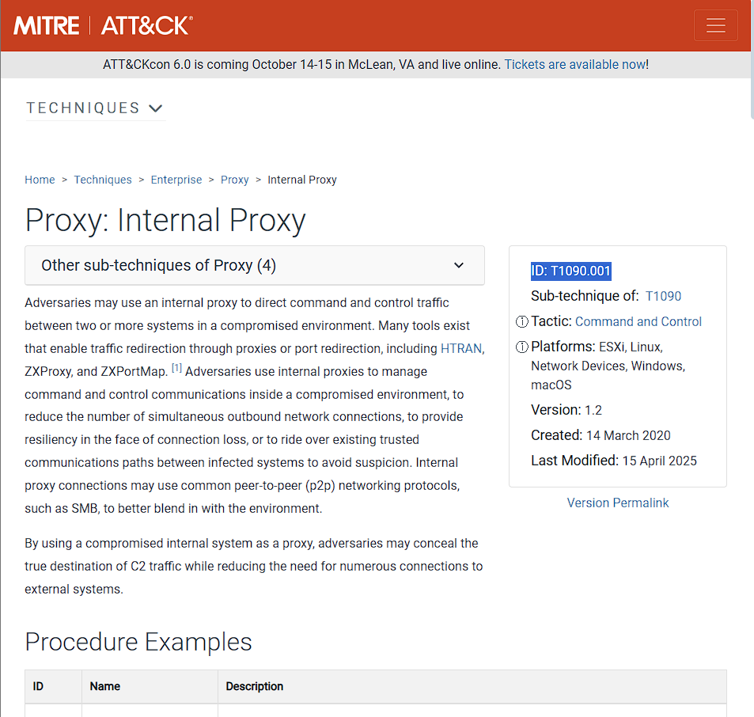

**Answer:** `T1090.001`

---

## 🚩 Flag 14: Enable Cmdline

**Question:** What command did the admin use to enable command-line logging? (command)

**Context:** Audit policy change logs and admin shell history can reveal the exact command used to enable process command-line capture.

**Explanation:**  
Event ID **4719** (System audit policy change) indicated that an audit policy modification occurred prior to the incident. To find the concrete command the administrator ran, I checked the PowerShell console history (ConsoleHost_history.txt) under the Administrator profile. The history recorded a registry modification that enabled command-line capture for process creation events. That exact command—entered in an administrative shell—adds a DWORD value enabling `ProcessCreationIncludeCmdLine_Enabled`. This registry change instructs Windows auditing to include the full command-line in process creation events going forward, which improves forensic visibility (and in this case, helped us reconstruct the attack).

**Pictures:**  
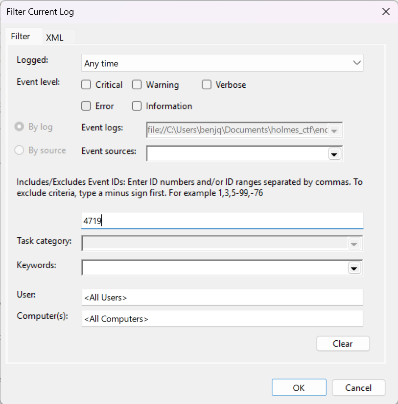  
  
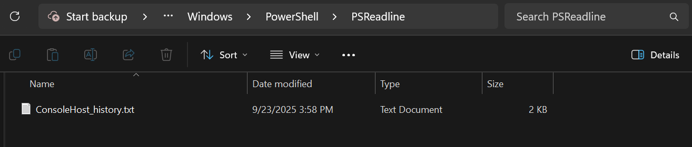  
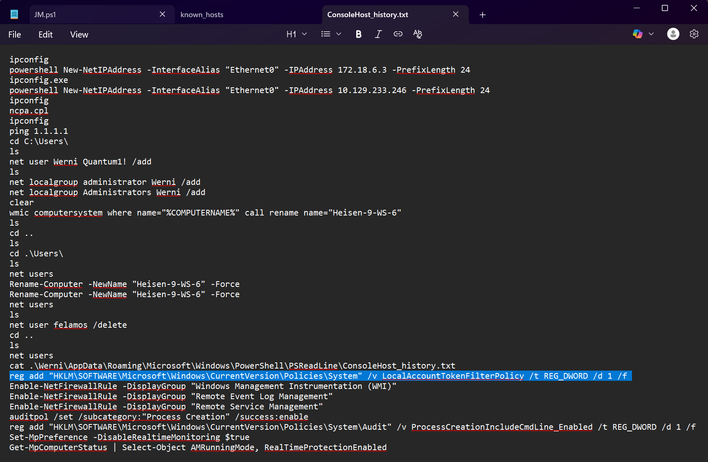

**Answer:**  
```cmd
reg add "HKLM\Software\Microsoft\Windows\CurrentVersion\Policies\System\Audit" /v ProcessCreationIncludeCmdLine_Enabled /t REG_DWORD /d 1 /f

