# Holmes CTF 2025: *The Card*

**Author:** Jonathan Lutabingwa ([@jtlutabingwa](https://github.com/jlutabin))

**Team:** Sherlock's Homies
- [Jonathan Lutabingwa](https://www.linkedin.com/in/jonathan-lutabingwa/)  
- [Benjamin Taylor](https://www.linkedin.com/in/btayl106/)  
- [Greyson Brummer](https://www.linkedin.com/in/greyson-brummer-b82119301/)  
- [Lansina Diakite](https://www.linkedin.com/in/lansina-diakite-7a673b202/)  
- [Shaunak Peri](https://www.linkedin.com/in/shaunak-peri-315744245/)
- 

**Prompt:** Holmes receives a breadcrumb from Dr. Nicole Vale - fragments from a string of cyber incidents across Cogwork-1. Each lead ends the same way: a digital calling card signed JM.

**Summary:** Multi-stage web attack against Nicole Vale’s honeypot attributed to actor “JM”: initial reconnaissance (distinct User-Agent), WAF bypass with web shell deployment, database exfiltration, malware persistence, and infrastructure mapping via Cogwork platforms.

**🟩 Challenge Difficulty:** *EASY*

---

## TL;DR (Answers)

- **User-Agent (first used):** `Lilnunc/4A4D - SpecterEye`
- **Web shell filename:** `temp_4A4D.php`
- **Exfiltrated DB:** `database_dump_4A4D.sql`
- **Recurring string:** `4A4D`
- **OmniYard campaigns linked:** `5`
- **Tools + malware count:** `9`
- **Malware SHA-256:** `7477c4f5e6d7c8b9a0f1e2d3c4b5a6f7e8d9c0b1a2f3e4d5c6b7a8f9e0d17477`
- **C2 IP (from CogWork):** `74.77.74.77`
- **Persistence file path:** `/opt/lilnunc/implant/4a4d_persistence.sh`
- **Open ports (CogNet scan):** `11`
- **Owning organization:** `SenseShield MSP`
- **Banner string:** `He's a ghost I carry, not to haunt me, but to hold me together - NULLINC REVENGE`

---

## The Watchman's Residue — Detailed Writeup (with images)

---

## 🚩 Flag 1 — First User-Agent

**Question:** What is the first User-Agent used by the attacker against Nicole Vale's honeypot?

**Context:** We begin by inspecting the HTTP access logs from the honeypot to identify the earliest recorded client fingerprint that interacted with the site.

**Explanation:** The `access.log` file contains chronological HTTP requests. The very first entry shows a `GET /robots.txt` request with a distinctive User-Agent string. Because this is the earliest HTTP line in the log and it specifies the client agent directly, it reliably identifies the attacker's initial fingerprint against the honeypot.

**Solution line (from `access.log`):**  
`2025-05-01 08:23:12 121.36.37.224 - - [01/May/2025:08:23:12 +0000] "GET /robots.txt HTTP/1.1" 200 847 "-" "Lilnunc/4A4D - SpecterEye"`

**Picture:**  

**Answer:** `Lilnunc/4A4D - SpecterEye`

---

## 🚩 Flag 2 — Web Shell Deployment

**Question:** After bypassing the WAF, what web shell filename was created?

**Context:** WAF logs often capture attempts to deploy web shells or note when protections have been bypassed. Hunting `waf.log` for critical bypass events is the quickest route.

**Explanation:** The WAF log contains a `CRITICAL` event labeled `WEBSHELL_DEPLOYMENT` and lists the action as `BYPASS`. That entry explicitly names the created PHP web shell. Because the WAF recorded both the bypass and the resulting creation, this log entry is authoritative for the deployed filename.

**Solution line (from `waf.log`):**  
`2025-05-15 11:25:12 [CRITICAL] waf.exec - IP 121.36.37.224 - Rule: WEBSHELL_DEPLOYMENT - Action: BYPASS - PHP web shell temp_4A4D.php created`

**Picture:**  
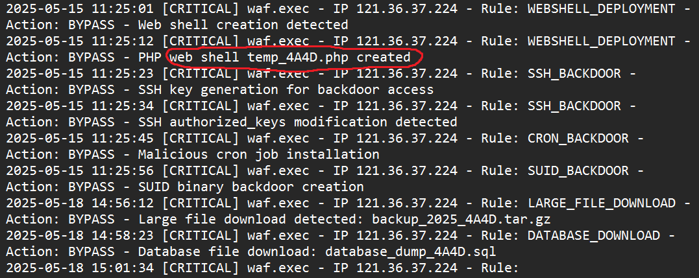

**Answer:** `temp_4A4D.php`

---

## 🚩 Flag 3 — Database Exfiltration

**Question:** What is the name of the database file that was exfiltrated?

**Context:** After the web shell was in place, the attacker used it to package and download site data. The access log records outgoing GET requests for those packaged files.

**Explanation:** Cross-referencing `waf.log` (which signaled a data exfiltration rule) and the `access.log` shows an attacker-initiated request to download a large `.sql` file. The earlier `find` commands found by the attacker and the web-shell tar command in the logs show the workflow: locate sensitive files → pack them → download the resulting dump. The large 52MB response confirms a full SQL dump was retrieved.

**Solution line (from `access.log`):**  
`2025-05-18 14:58:23 121.36.37.224 - - [18/May/2025:15:58:23 +0000] "GET /uploads/database_dump_4A4D.sql HTTP/1.1" 200 52428800 "-" "4A4D RetrieveR/1.0.0"`

**Picture:**  
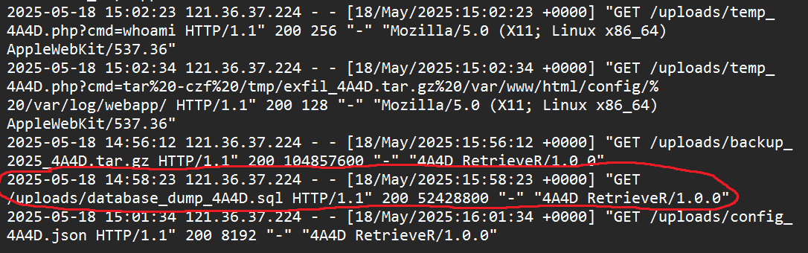

**Answer:** `database_dump_4A4D.sql`

---

## 🚩 Flag 4 — Recurring String

**Question:** Which recurring (seemingly meaningless) string appears throughout the attack artifacts?

**Context:** Repeating tokens across different artifacts (User-Agent, filenames, dump names) often indicate a campaign tag or actor indicator.

**Explanation:** I searched all logs for the short token `4A4D` and found it in multiple distinct contexts: the initial User-Agent, the web shell filename, the SQL dump filename, a backup tarball name, and even in a downloader User-Agent. The repetition across different artifact types (UA, filenames, backups, downloader strings) makes `4A4D` a reliable campaign marker and the correct answer.

**Picture:**  
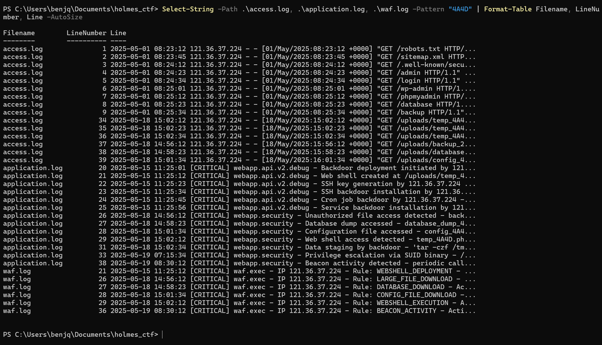

**Answer:** `4A4D`

---

## 🚩 Flag 5 — Campaigns Linked

**Question:** How many campaigns appear to be linked to the honeypot attack (OmniYard-3)?

**Context:** The CogWork-Intel graph visualizes entity relationships; counting campaign nodes connected to the attacker cluster reveals campaign scope.

**Explanation:** Using the provided `IP:port` feed into the CogWork-Intel graph, I inspected the cluster around the honeypot-linked indicator. The graph displayed several campaign sub-nodes attached to the central actor node. Counting the directly connected campaign nodes (those explicitly labeled as campaigns) yields the total linked campaigns.

**Picture:**  
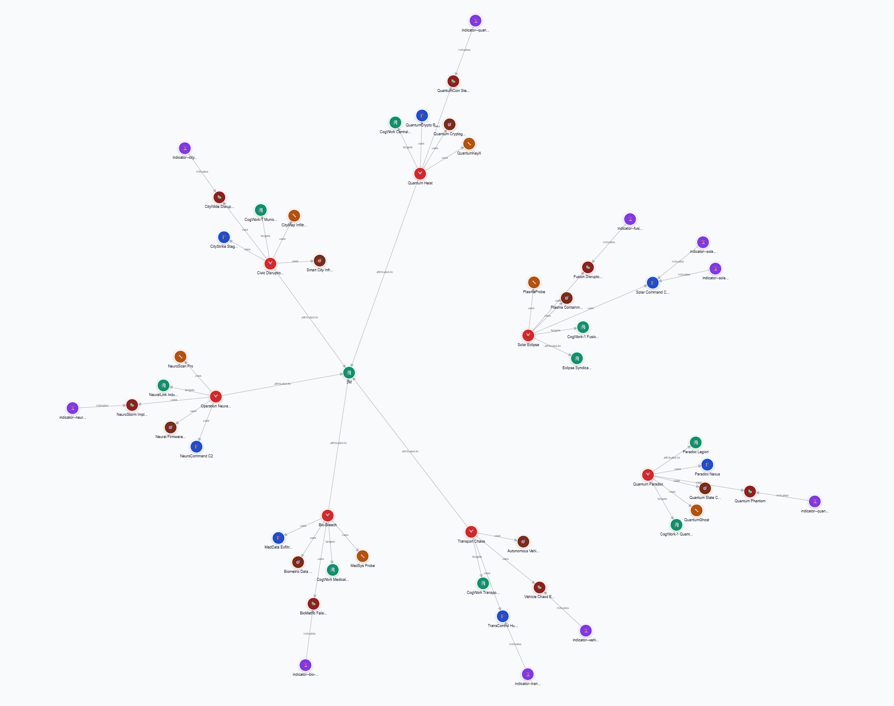

**Answer:** `5`

---

## 🚩 Flag 6 — Tools + Malware

**Question:** How many tools and malware samples (total) are linked to the identified campaigns?

**Context:** Within the campaign cluster, entities are categorized (e.g., tools vs. malware). Counting all entities of those categories gives the requested total.

**Explanation:** I expanded the five campaign nodes and tallied the entities labeled as *Tools* and *Malware*. The catalogued breakdown showed 4 tool entities and 5 malware entities tied to those campaigns; summing both categories produces the total number of offensive artifacts associated with the actor.

**Picture:**  
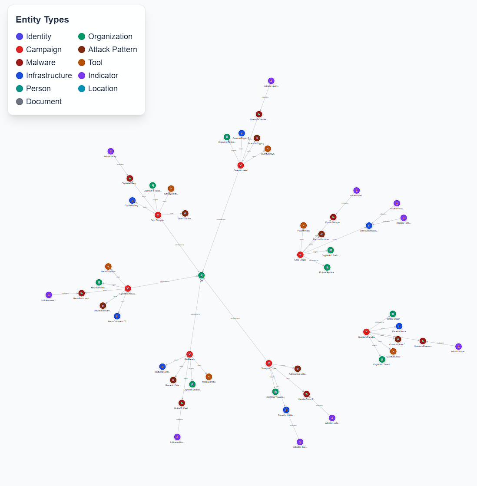

**Answer:** `9`

---

## 🚩 Flag 7 — SHA-256 Hash

**Question:** What is the SHA-256 hash of the malware used consistently across campaigns?

**Context:** The graph and indicator pages expose artifact metadata; indicators often include file hash patterns.

**Explanation:** I followed the indicator entity related to the `4A4D` artifact family to its details page. The indicator’s pattern section included the canonical file hash used to uniquely identify the malware. This value corresponds to the persistent sample seen in multiple campaign linkages.

**Picture:**  
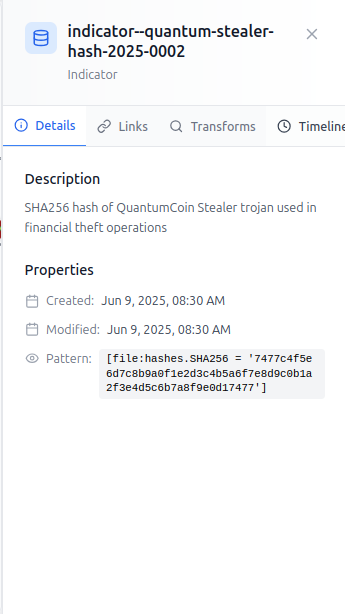

**Answer:** `7477c4f5e6d7c8b9a0f1e2d3c4b5a6f7e8d9c0b1a2f3e4d5c6b7a8f9e0d17477`

---

## 🚩 Flag 8 — C2 IP Address

**Question:** Using the SHA-256 hash, what IP address does the malware contact?

**Context:** Searching the security platform for the known hash yields enriched telemetry — often including network connections seen in sandboxing or telemetry correlation.

**Explanation:** I pasted the SHA-256 into the CogWork Security search and opened the malware detail page. The enrichment data included observed network callbacks for that sample; the platform listed the primary C2 host observed contacting the sample. That host is the address the malware has been observed to reach out to.

**Pictures:**  
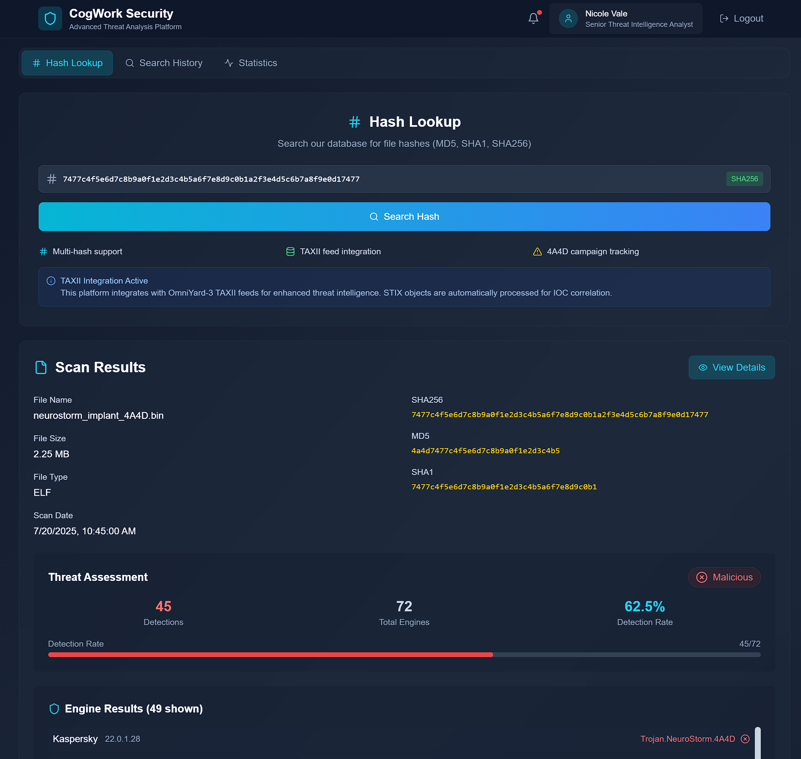  
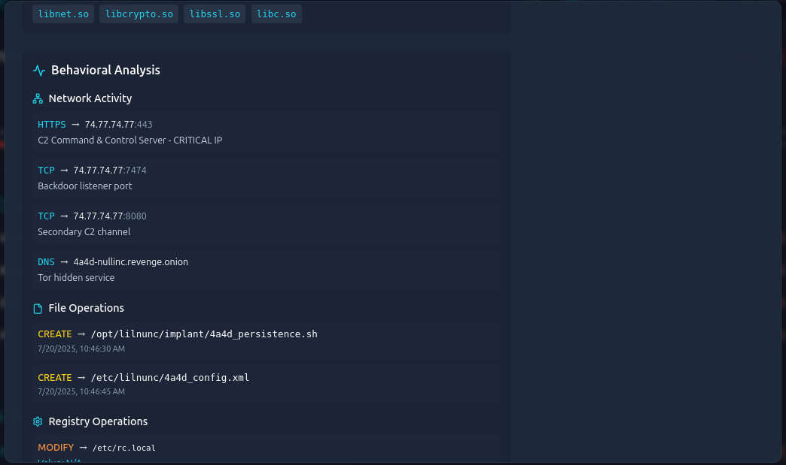

**Answer:** `74.77.74.77`

---

## 🚩 Flag 9 — Persistence File Path

**Question:** What full file path did the malware create to maintain persistence?

**Context:** Malware behavior pages typically show file-system operations (create, move, modify). The create operation that writes a persistence artifact reveals the path.

**Explanation:** On the file-operations pane of the malware details, I filtered for `CREATE` operations and looked for filenames containing “persist” or similar. The entry showed the artifact written to a Linux-style location under `/opt/...`, which is a common persistence staging place for malicious implants.

**Picture:**  
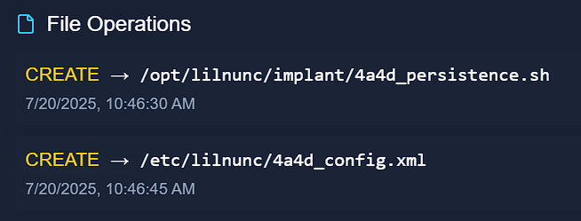

**Answer:** `/opt/lilnunc/implant/4a4d_persistence.sh`

---

## 🚩 Flag 10 — Open Ports

**Question:** According to the CogNet Scanner, how many open ports does the server host?

**Context:** The CogNet scan result for the C2 IP returns a list of discovered open TCP/UDP ports in its scan summary.

**Explanation:** I submitted the C2 IP (`74.77.74.77`) to the CogNet Scanner view shown in the platform. The detailed scan page enumerates the discovered listening ports along with related service banners and CVEs. The scan summary clearly lists the count of open ports — that number is what the question requests.

**Pictures:**  
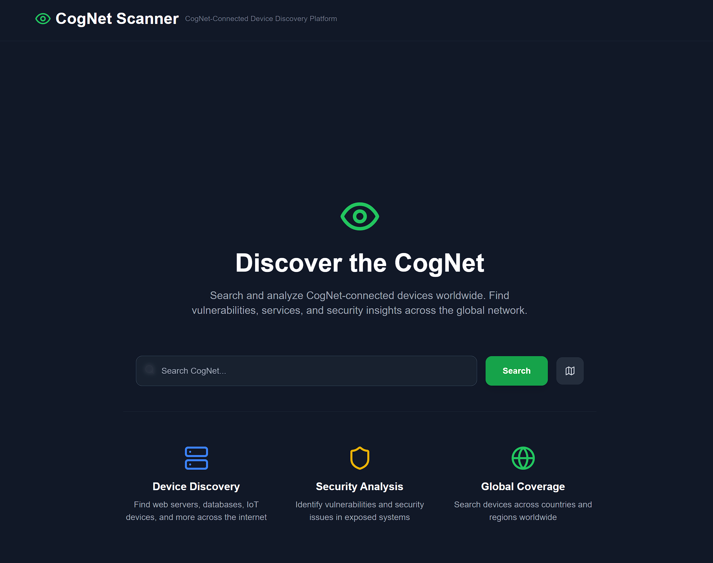  

**Answer:** `11`

---

## 🚩 Flag 11 — Organization

**Question:** Which organization is associated with the C2 IP?

**Context:** The scan and network info in the CogNet tile provide ISP / org metadata derived from WHOIS and passive data sources.

**Explanation:** On the C2 scan details page (network information block), the organization field lists the entity that owns or operates the IP. This is the authoritative organizational label shown by the platform for this host.

**Picture:**  

**Answer:** `SenseShield MSP`

---

## 🚩 Flag 12 — Cryptic Banner

**Question:** One service banner contains a cryptic message. What does it say?

**Context:** Service banner grabbing on a high-numbered port revealed an odd, human-readable string instead of a standard protocol greeting.

**Explanation:** Reviewing the banner output for the service running on port `7477/tcp` in the scan results showed a non-standard banner string. That banner includes a short, quoted phrase that appears intentionally placed (likely an actor signature or taunt). The banner text is shown verbatim below and is the requested flag.

**Picture:**  
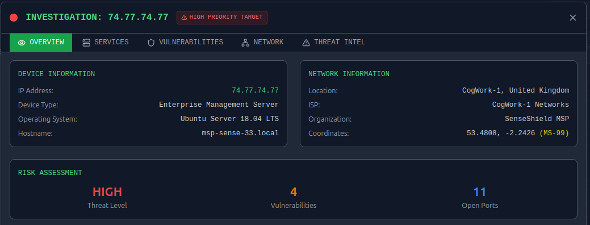

**Answer:** `He's a ghost I carry, not to haunt me, but to hold me together - NULLINC REVENGE`

---

**Next challenge writeup:** [Holmes — The Watchman's Residue 👮](./holmes_watchmans_residue.md)
