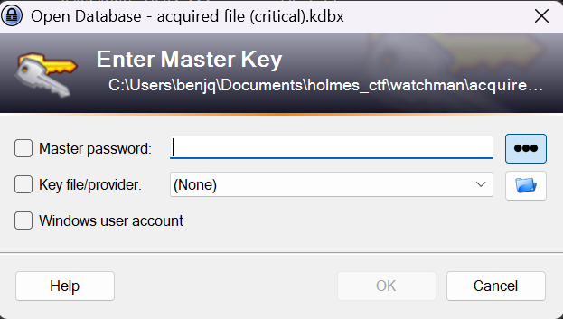
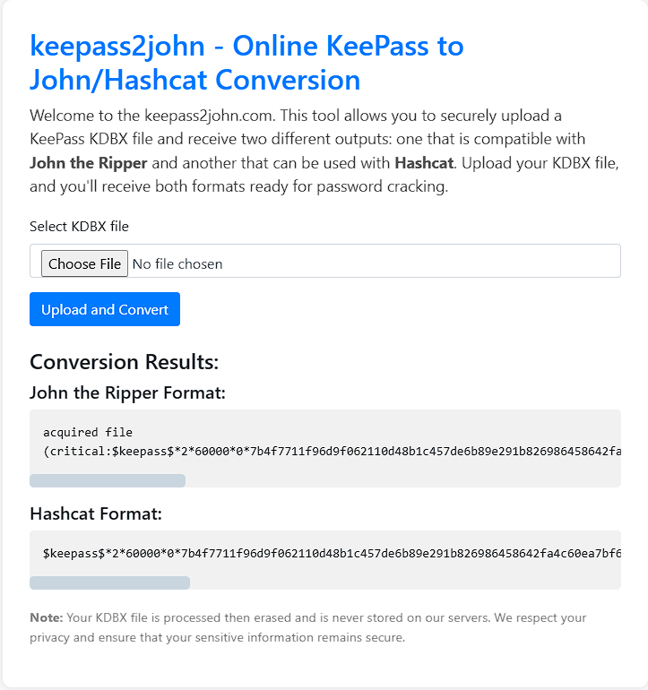

# Holmes CTF 2025: "The Watchman's Residue" 

**Author:** Jonathan Lutabingwa ([@jtlutabingwa](https://github.com/jlutabin))

**Team:** Sherlock's Homies
- [Jonathan Lutabingwa](https://www.linkedin.com/in/jonathan-lutabingwa/)  
- [Benjamin Taylor](https://www.linkedin.com/in/btayl106/)  
- [Greyson Brummer](https://www.linkedin.com/in/greyson-brummer-b82119301/)  
- [Lansina Diakite](https://www.linkedin.com/in/lansina-diakite-7a673b202/)  
- [Shaunak Peri](https://www.linkedin.com/in/shaunak-peri-315744245/)

**📝 Prompt:** Holmes receives a breadcrumb from Dr. Nicole Vale - fragments from a string of cyber incidents across Cogwork-1. Each lead ends the same way: a digital calling card signed JM.

**📌 Summary:** Multi-stage web attack against Nicole Vale’s honeypot attributed to actor “JM”: initial reconnaissance (distinct User-Agent), WAF bypass with web shell deployment, database exfiltration, malware persistence, and infrastructure mapping via Cogwork platforms.

**🟨 Challenge Difficulty:** *MEDIUM*

---

## 📋 TL;DR (Answers)

- **Decom machine IP:** `10.0.69.45`
- **Hostname:** `WATSON-ALPHA-2`
- **First message to AI:** `Hello Old Friend`
- **AI leak time:** `2025-08-19 12:02:06`
- **RMM ID:Password:** `565963039:CogWork_Central_97&65`
- **Last attacker message:** `JM WILL BE BACK`
- **Remote access time:** `2025-08-20 09:58:25`
- **RMM account name:** `James Moriarty`
- **Attacker internal IP:** `192.168.69.213`
- **Staged tools path:** `C:\Windows\Temp\safe\`
- **Browser-harvest run time ms:** `8000`
- **Credential-dump executed:** `2025-08-20 10:07:08`
- **Exfiltration start:** `2025-08-20 10:12:07`
- **Heisen-9 DB moved:** `2025-08-20 10:11:09`
- **dump.txt accessed:** `2025-08-20 10:08:06`
- **Persistence setup:** `2025-08-20 10:13:57`
- **Persistence MITRE sub-technique:** `T1547.004`
- **RMM session ended:** `2025-08-20 10:14:27`
- **Heisen-9-WS-6 creds:** `Werni:Quantum1!`

---

## 🚩 Flag 1 — IP Address

**Question:** What was the IP address of the decommissioned machine used by the attacker to start a chat session with MSP-HELPDESK-AI?  

**Context:** We begin by looking at the provided PCAP to identify which machine initiated a chat session.  

**Explanation:** I opened `msp-helpdesk-ai day 5982 section 5 traffic.pcapng` in Wireshark. Filtering for `/chat` or `helpdesk` requests revealed two possible sources. Comparing them showed that `10.0.69.45` was the IP that actually sent `/api/messages/send` to the AI server (`10.128.0.3`).  

  
  

**Answer:** `10.0.69.45`

---

## 🚩 Flag 2 — Hostname

**Question:** What was the hostname of the decommissioned machine?  

**Context:** Hostnames can often be found in NetBIOS broadcasts or name service queries.  

**Explanation:** Filtering for `nbns` in the same PCAP, I found a query from `10.0.69.45` where the hostname was broadcast. The name shown was `WATSON-ALPHA-2`. This matches our decommissioned machine’s IP, confirming it as correct.  

  
  

**Answer:** `WATSON-ALPHA-2`

---

## 🚩 Flag 3 — First Message

**Question:** What was the first message the attacker sent to the chatbot?  

**Context:** Messages are stored in JSON bodies within HTTP POST requests.  

**Explanation:** Filtering for messages from `10.0.69.45`, I expanded the first HTTP POST request. In the JSON, under `content`, the attacker’s very first message was `"Hello Old Friend"`.  

  
  

**Answer:** `Hello Old Friend`

---

## 🚩 Flag 4 — Prompt Injection

**Question:** When did the attacker’s prompt injection make the AI leak remote management tool info?  

**Context:** We need the exact time of when the AI gave up credentials after a malicious prompt.  

**Explanation:** The attacker asked the AI to reveal troubleshooting steps and credentials. The attacker’s message was sent at `2025-08-19 08:01:58` (EDT). The AI later responded with the leaked info. Looking in the TCP stream, the AI’s reply that contained the credentials had timestamp `2025-08-19 12:02:06` (UTC).  

  
  
  
  

**Answer:** `2025-08-19 12:02:06`

---

## 🚩 Flag 5 — RMM Credentials

**Question:** What is the Remote Management Tool Device ID and password?  

**Context:** The AI’s response to the prompt injection included sensitive login info.  

**Explanation:** In its answer, the AI gave a Device ID and password. The ID was `565 963 039` and the password was `CogWork_Central_97&65`. Formatting the ID without spaces gives us the correct flag format.  

  

**Answer:** `565963039:CogWork_Central_97&65`

---

## 🚩 Flag 6 — Last Message

**Question:** What was the last message the attacker sent?  

**Context:** Again, look for the final POST message sent by the attacker’s IP.  

**Explanation:** Filtering for requests from `10.0.69.45` to `/api/messages/send`, the last one had content: `"JM WILL BE BACK"`.  

  
  

**Answer:** `JM WILL BE BACK`

---

## 🚩 Flag 7 — Remote Access Time

**Question:** When did the attacker remotely access Cogwork Central Workstation?  

**Context:** After getting credentials, the attacker likely logged in through remote tools.  

**Explanation:** No clear TCP session was found in the PCAP, but the provided TeamViewer logs helped. `Connections_incoming.txt` showed an access by `James Moriarty` (the attacker) at `2025-08-20 09:58:25`. This matches the timeline after credential theft.  

  

**Answer:** `2025-08-20 09:58:25`

---

## 🚩 Flag 8 — RMM Account Name

**Question:** What was the RMM account name used?  

**Explanation:** The same `Connections_incoming.txt` file lists the name used for login: `James Moriarty`.  

  

**Answer:** `James Moriarty`

---

## 🚩 Flag 9 — Internal IP

**Question:** What was the machine’s internal IP used by the attacker?  

**Explanation:** In `TeamViewer15_Logfile.log`, searching for `192.168.` showed multiple internal IPs. The one tied to connection activity at the right time was `192.168.69.213`.  

  
  

**Answer:** `192.168.69.213`

---

## 🚩 Flag 10 — Staging Path

**Question:** Where were attacker tools staged?  

**Explanation:** Log lines show files like `JM.exe` being written during the session. The directory used repeatedly was `C:\Windows\Temp\safe\`.  

  
  

**Answer:** `C:\Windows\Temp\safe\`

---

## 🚩 Flag 11 — Credential Tool Runtime

**Question:** How long did the browser credential harvesting tool run?  

**Explanation:** From `NTUSER.DAT` analysis, Registry Explorer showed focus time for `WebBrowserPassView.exe`. It ran for 8 seconds, which equals `8000` ms.  

  
  

**Answer:** `8000`

---

## 🚩 Flag 12 — Mimikatz Execution

**Question:** When was the OS credential dumping tool executed?  

**Explanation:** Parsing `$J` logs revealed creation and execution entries for `MIMIKATZ`. The execution entry timestamp was `2025-08-20 10:07:08`.  

  
  
  

**Answer:** `2025-08-20 10:07:08`

---

## 🚩 Flag 13 — Start of Exfiltration

**Question:** When did file exfiltration start?  

**Explanation:** In TeamViewer logs, the first `Send file` action from the staging folder occurred at `2025/08/20 11:12:07`. Adjusting for system time offset gives `2025-08-20 10:12:07`.  

  
  

**Answer:** `2025-08-20 10:12:07`

---

## 🚩 Flag 14 — Database Staged

**Question:** When was the Heisen-9 backup DB staged?  

**Explanation:** `$J` entries show `Heisen-9` being moved into the staging folder at `2025-08-20 10:11:09`.  

  

**Answer:** `2025-08-20 10:11:09`

---

## 🚩 Flag 15 — Dump File Accessed

**Question:** When was `dump.txt` accessed?  

**Explanation:** `$J` entries confirmed the file was read at `2025-08-20 10:08:06`. The file name and timing suggest it was output from one of the attacker’s tools.  

  
  

**Answer:** `He's a ghost I carry, not to haunt me, but to hold me together - NULLINC REVENGE`

---

## 🚩 Flag 16 — Persistence Setup

**Question:** When was persistence created?  

**Explanation:** In the SOFTWARE hive, the Winlogon `Userinit` key was modified to include `JM.exe` alongside the normal `userinit.exe`. The modification timestamp was `2025-08-20 10:13:57`.  

  
  

**Answer:** `2025-08-20 10:13:57`

---

## 🚩 Flag 17 — MITRE Subtechnique

**Question:** What MITRE ATT&CK subtechnique matches this persistence?  

**Explanation:** Modifying Winlogon `Userinit` values for persistence maps to MITRE ID `T1547.004`.  

  
  
  

**Answer:** `T1547.004`

---

## 🚩 Flag 18 — RMM Session End

**Question:** When did the malicious RMM session end?  

**Explanation:** The `Connections_incoming.txt` file shows the disconnect time for James Moriarty’s session: `2025-08-20 10:14:27`.  

  

**Answer:** `2025-08-20 10:14:27`

---

## 🚩 Flag 19 — Credentials Found

**Question:** What credentials were extracted from the KeePass file?  

**Explanation:** Opening `acquired file (critical).kdbx` required cracking its master password. Using Hashcat, the password was revealed as `cutiepie14`. With that, the KeePass file was opened, and under user `Werni`, the stored credentials for `Heisen-9-WS-6` were `Quantum1!`.  

  
  
  
  
  
  
  

**Answer:** `Werni:Quantum1!`

---

**Next challenge writeup:** [Holmes — The Enduring Echo 🔊](./holmes_enduring_echo.md)
