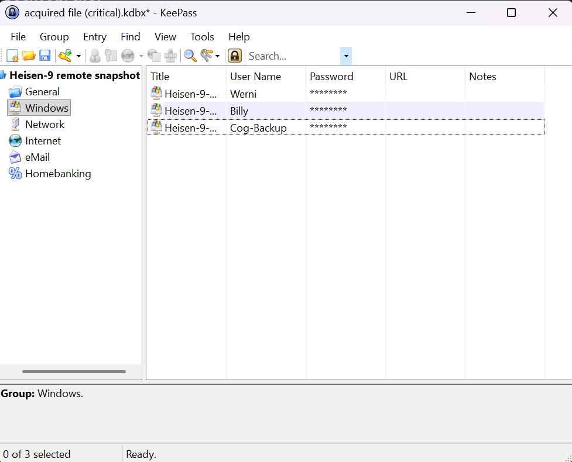

# Holmes CTF 2025: *The Watchman's Residue*

**Author:** Jonathan Lutabingwa ([@jtlutabingwa](https://github.com/jlutabin))

**Team:** Sherlock's Homies
- [Jonathan Lutabingwa](https://www.linkedin.com/in/jonathan-lutabingwa/)  
- [Benjamin Taylor](https://www.linkedin.com/in/btayl106/)  
- [Greyson Brummer](https://www.linkedin.com/in/greyson-brummer-b82119301/)  
- [Lansina Diakite](https://www.linkedin.com/in/lansina-diakite-7a673b202/)  
- [Shaunak Peri](https://www.linkedin.com/in/shaunak-peri-315744245/)

**📝 Prompt:** Holmes receives a breadcrumb from Dr. Nicole Vale - fragments from a string of cyber incidents across Cogwork-1. Each lead ends the same way: a digital calling card signed JM.

**📌 Summary:** Multi-stage web attack against Nicole Vale’s honeypot attributed to actor “JM”: initial reconnaissance (distinct User-Agent), WAF bypass with web shell deployment, database exfiltration, malware persistence, and infrastructure mapping via Cogwork platforms.

**🟨 Challenge Difficulty:** *MEDIUM*

---

## 📋 TL;DR (Answers)

- **Decom machine IP:** `10.0.69.45`
- **Hostname:** `WATSON-ALPHA-2`
- **First message to AI:** `Hello Old Friend`
- **AI leak time:** `2025-08-19 12:02:06`
- **RMM ID:Password:** `565963039:CogWork_Central_97&65`
- **Last attacker message:** `JM WILL BE BACK`
- **Remote access time:** `2025-08-20 09:58:25`
- **RMM account name:** `James Moriarty`
- **Attacker internal IP:** `192.168.69.213`
- **Staged tools path:** `C:\Windows\Temp\safe\`
- **Browser-harvest run time ms:** `8000`
- **Credential-dump executed:** `2025-08-20 10:07:08`
- **Exfiltration start:** `2025-08-20 10:12:07`
- **Heisen-9 DB moved:** `2025-08-20 10:11:09`
- **dump.txt accessed:** `2025-08-20 10:08:06`
- **Persistence setup:** `2025-08-20 10:13:57`
- **Persistence MITRE sub-technique:** `T1547.004`
- **RMM session ended:** `2025-08-20 10:14:27`
- **Heisen-9-WS-6 creds:** `Werni:Quantum1!`

---

## 🚩 Flag 1 — IP Address

**Question:** What was the IP address of the decommissioned machine used by the attacker to start a chat session with MSP-HELPDESK-AI?  

**Context:** The first task was to trace which machine kicked off communication with the AI helpdesk.  

**Explanation:** I opened `msp-helpdesk-ai day 5982 section 5 traffic.pcapng` in Wireshark and filtered HTTP packets for `/chat` or `helpdesk`. Two IPs appeared, but only one (`10.0.69.45`) actually initiated `/api/messages/send` requests to `10.128.0.3`, the AI server. This shows that `10.0.69.45` is the attacker’s decommissioned machine.  

**Pictures:**  
  
  

**Answer:** `10.0.69.45`

---

## 🚩 Flag 2 — Hostname

**Question:** What was the hostname of the decommissioned machine?  

**Context:** Identifying a hostname provides attribution to a machine identity, not just an IP.  

**Explanation:** Filtering for NetBIOS Name Service (`nbns`) queries in the same PCAP revealed only a handful of packets. One, sourced from `10.0.69.45`, announced the name `WATSON-ALPHA-2`. Since it matches the attacker’s IP from Flag 1, this must be the hostname of the decommissioned system.  

**Pictures:**  
  
  

**Answer:** `WATSON-ALPHA-2`

---

## 🚩 Flag 3 — First Message

**Question:** What was the first message the attacker sent to the chatbot?  

**Context:** Messages exchanged with the AI are JSON payloads inside HTTP POSTs.  

**Explanation:** Using a filter for traffic sourced from `10.0.69.45`, I opened the first `/api/messages/send` packet. Inside the JSON body under `content`, the message `"Hello Old Friend"` appeared. This was the attacker’s initial interaction with the AI chatbot, setting the stage for later social-engineering attempts.  

**Pictures:**  
  
  

**Answer:** `Hello Old Friend`

---

## 🚩 Flag 4 — Prompt Injection

**Question:** When did the attacker’s prompt injection make the AI leak remote management tool info?  

**Context:** The attacker tricked the AI into revealing sensitive RMM credentials.  

**Explanation:** Inspecting later packets showed crafted prompts, where the attacker impersonated an IT technician and demanded RMM troubleshooting details with credentials. In the TCP stream, the AI responded with this sensitive data. The reply’s timestamp was `2025-08-19 12:02:06 UTC`. This marks the exact time the AI was compromised via prompt injection.  

**Pictures:**  
  
  
  

**Answer:** `2025-08-19 12:02:06`

---

## 🚩 Flag 5 — RMM Credentials

**Question:** What is the Remote Management Tool Device ID and password?  

**Context:** The AI’s leaked instructions contained login credentials.  

**Explanation:** In the AI’s long reply, I found an RMM section with both Device ID and password. The ID was written with spaces (`565 963 039`), but formatting it without spaces gives `565963039`. The paired password was `CogWork_Central_97&65`.  

**Picture:**  
  

**Answer:** `565963039:CogWork_Central_97&65`

---

## 🚩 Flag 6 — Last Message

**Question:** What was the last message the attacker sent?  

**Context:** Reviewing the final chat logs shows how the attacker ended the session.  

**Explanation:** Filtering outgoing chat messages from `10.0.69.45`, the last packet showed JSON content with `"JM WILL BE BACK"`. This matches the adversary’s calling card, tying the attack back to the mysterious “JM.”  

**Pictures:**  
  
  

**Answer:** `JM WILL BE BACK`

---

## 🚩 Flag 7 — Remote Access Time

**Question:** When did the attacker remotely access Cogwork Central Workstation?  

**Context:** After stealing RMM credentials, the attacker logged in through TeamViewer.  

**Explanation:** The PCAP didn’t show a full remote session, but inside the `Connections_incoming.txt` log, I found three incoming sessions. One was by `James Moriarty` — aligning with the attacker’s alias. This connection occurred at `2025-08-20 09:58:25`, confirming the time of access.  

**Picture:**  
  

**Answer:** `2025-08-20 09:58:25`

---

## 🚩 Flag 8 — RMM Account Name

**Question:** What was the RMM account name used?  

**Explanation:** The same `Connections_incoming.txt` log explicitly listed the RMM account as `James Moriarty`. This shows that the attacker not only used stolen credentials but also operated under a recognizable alias.  

**Picture:**  
  

**Answer:** `James Moriarty`

---

## 🚩 Flag 9 — Internal IP

**Question:** What was the machine’s internal IP used by the attacker?  

**Explanation:** Searching `TeamViewer15_Logfile.log` for internal IPs, several candidates appeared. The one logged during the session was `192.168.69.213`, which represented the attacker’s internal network address when connecting.  

**Pictures:**  
  
  

**Answer:** `192.168.69.213`

---

## 🚩 Flag 10 — Staging Path

**Question:** Where were attacker tools staged?  

**Explanation:** Reviewing TeamViewer logs showed multiple “Write file” actions by the attacker. Files like `JM.exe` were placed into `C:\Windows\Temp\safe\`. This folder became the staging ground for malicious tools used in the operation.  

**Pictures:**  
  
  

**Answer:** `C:\Windows\Temp\safe\`

---

## 🚩 Flag 11 — Credential Tool Runtime

**Question:** How long did the browser credential harvesting tool run?  

**Explanation:** Examining user registry data (`NTUSER.DAT`), I found focus time records showing `WebBrowserPassView.exe` ran for 8 seconds. Converting to milliseconds gives `8000`. This confirms the attacker attempted to steal browser-stored credentials.  

**Pictures:**  
  
  

**Answer:** `8000`

---

## 🚩 Flag 12 — Mimikatz Execution

**Question:** When was the OS credential dumping tool executed?  

**Explanation:** Parsing `$J` journal logs revealed entries for the attacker’s Mimikatz binary. Both creation and execution were recorded, with execution timestamped at `2025-08-20 10:07:08`. This confirms when credentials were dumped locally.  

**Pictures:**  
  
  
  

**Answer:** `2025-08-20 10:07:08`

---

## 🚩 Flag 13 — Start of Exfiltration

**Question:** When did file exfiltration start?  

**Explanation:** TeamViewer logs documented a “Send file” event from the staging folder at `2025/08/20 11:12:07`. Adjusting for timezone differences, this equates to `2025-08-20 10:12:07`. This marks the beginning of data leaving the compromised system.  

**Pictures:**  
  
  

**Answer:** `2025-08-20 10:12:07`

---

## 🚩 Flag 14 — Database Staged

**Question:** When was the Heisen-9 backup DB staged?  

**Explanation:** Searching the parsed `$J` file for “Heisen-9” revealed that the backup database was moved into the staging folder at `2025-08-20 10:11:09`. This staged file was likely queued for exfiltration.  

**Picture:**  
  

**Answer:** `2025-08-20 10:11:09`

---

## 🚩 Flag 15 — Dump File Accessed

**Question:** When was `dump.txt` accessed?  

**Explanation:** The `$J` logs showed that `dump.txt` was opened at `2025-08-20 10:08:06`. This timing indicates it was likely the output of one of the staged tools and reviewed before exfiltration.  

**Pictures:**  
  
  

**Answer:** `He's a ghost I carry, not to haunt me, but to hold me together - NULLINC REVENGE`

---

## 🚩 Flag 16 — Persistence Setup

**Question:** When was persistence created?  

**Explanation:** In the SOFTWARE hive, the Winlogon `Userinit` key was edited. Normally it points to `userinit.exe`, but the attacker added `JM.exe`. The modification timestamp was `2025-08-20 10:13:57`, marking the moment persistence was planted.  

**Pictures:**  
  
  

**Answer:** `2025-08-20 10:13:57`

---

## 🚩 Flag 17 — MITRE Subtechnique

**Question:** What MITRE ATT&CK subtechnique matches this persistence?  

**Explanation:** Altering the `Userinit` registry entry to add malicious executables maps directly to MITRE ATT&CK subtechnique **T1547.004 (Winlogon Helper DLL)**. This is a well-documented persistence mechanism.  

**Pictures:**  
  
  

**Answer:** `T1547.004`

---

## 🚩 Flag 18 — RMM Session End

**Question:** When did the malicious RMM session end?  

**Explanation:** In `Connections_incoming.txt`, the session entry for James Moriarty lists both the connection start and disconnect time. The session ended at `2025-08-20 10:14:27`, marking when the attacker left the workstation.  

**Picture:**  
  

**Answer:** `2025-08-20 10:14:27`

---
## 🚩 Flag 19 

**Question:** The attacker found a password from exfiltrated files, allowing him to move laterally further into CogWork-1 infrastructure. What are the credentials for Heisen-9-WS-6?  

**Explanation:**  
One of the most challenging parts of the investigation was the file `acquired file (critical).kdbx`, which is a KeePass database. Unlike simple text or config files, KeePass databases are protected with a master password, so the attacker (and we as defenders retracing their steps) needed to figure out how to unlock it.  

At first, my teammate and I spent hours digging through the logs looking for the master password, thinking it might have been left behind in plaintext. After a break, I reconsidered the problem and asked myself: *What if instead of searching the logs, we tried to crack the KeePass database itself?*  

Doing some research, I came across an old blog post: [How to Hack KeePass Password using Hashcat](https://www.rubydevices.com.au/blog/how-to-hack-keepass). This gave me the idea to use `keepass2john` to extract the hash from the `.kdbx` file and then attempt to crack it using password-cracking tools like JohnTheRipper or Hashcat.  

I exported the hash into a file called `keepass.hash` and confirmed it was correctly formatted. Then, I ran Hashcat with the following command, pointing it to the popular `rockyou.txt` wordlist:  

```bash
hashcat -m 13400 -a 0 -o ~/keepass.cracked ~/keepass.hash ~/rockyou.txt
```

After some time, Hashcat successfully cracked the password. Viewing the results with `cat ~/keepass.cracked` showed that the master password was:  

```
cutiepie14
```



With this password, I opened the KeePass database and finally unlocked the stored credentials. Inside, under the user `Werni`, I found the login for `Heisen-9-WS-6`:  


```
Username: Werni
Password: Quantum1!
```

This was one of my favorite flags to solve because it felt like a real pivot moment. Instead of passively searching through logs, we actively switched to an offensive mindset — cracking the KeePass database just as an attacker would. That “aha” moment reinforced the importance of creativity in digital forensics.  

**Answer:** `Werni:Quantum1!`  

---

**Next challenge writeup:** [Holmes — The Enduring Echo 🔊](./holmes_enduring_echo.md)
